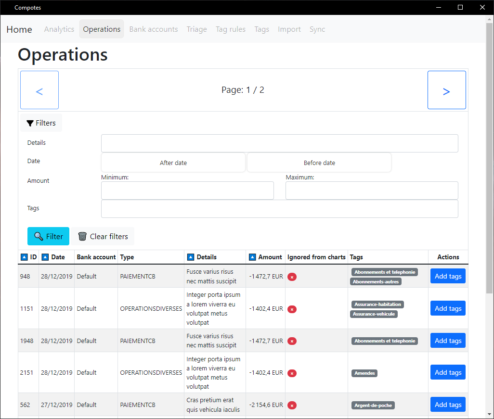

🍎 Compotes 🍏
=============

A small application to visualise bank operations in graphs and plots.

# 🧮

> This is the second version of the main app that was previously built with PHP and Symfony.
> 
> The new app is built in [Rust](https://www.rust-lang.org/) with [Tauri](https://tauri.studio/) for the backend, and uses [Typescript](https://www.typescriptlang.org/) and [Svelte](https://svelte.dev/) for the frontend part. 



### Roadmap

Since the entire app is being rewritten, lots of stuff have to be re-implemented.

> The "☑️" mark means the feature is implemented, while the "⬜️" mark means the feature is waiting for implementation.

* Core features:
  * ☑️ Create the Tauri app
  * ☑️ Create the Svelte frontend with it
  * ☑️ List operations
    * ⬜️ Allow sorting operations by some fields
    * ⬜️ Allow filtering operations
    * ⬜️ Allow saving current filter to be reused in graphs
    * ⬜️ Allow ignoring an operation in graphs calculations
  * ☑️ Tags CRUD
  * ☑️ Tag rules CRUD
  * ☑️ Bank accounts CRUD
    * ☑️ Edit bank account details
  * ☑️ Import operations from CSV file
  * ☑️ Add tags to operations directly from the list
  * ☑️ Sync operations for triage
  * ☑️ Sync operations tags with tag rules
  * ⬜️ Add the graphs that are at the core of this app 😅
    * ⬜️ Allow using saved filters for graphs 
    * ⬜️ Allow creating and saving custom graphs 
* Additional features that might be cool:
  * ⬜️ Allow customizing graphs
  * ⬜️ Config panel to allow customizing database, export/import whole database
  * ⬜️ User account system for multi-user usage
  * ⬜️ Encrypt entire database with a password for safety
* Some things are quite buggy and the app needs improvements too:
  * ⬜️ Check why we have to use `location.reload()` because svelte stores don't update the paginated tables
  * ⬜️ Use a `select2` or similar for tags selection

## Install

The project is not even in beta for now, but you might find latest nightly builds on the [Actions](https://github.com/Orbitale/Compotes/actions) page, if you check out the latest successful action marked by a "☑️" mark (if there is one at least).

## Project setup

If you want to use the in-development project, you can compile it by doing what is explained in the following steps.

### Requirements

* [Rust](https://www.rust-lang.org/tools/install)
* [Node.js](https://nodejs.org/en/download/)
* [Yarn](https://yarnpkg.com/getting-started/install) (preferred by the Tauri team, so expect better compatibility)
* For Linux users:
  * Follow [this guide](https://tauri.studio/docs/get-started/setup-linux#1-system-dependencies) to install the **system dependencies** that are mandatory.
* For Windows users:
  * [Webview2](https://developer.microsoft.com/en-us/microsoft-edge/webview2/#download-section)
* For MacOS users:
  * XCode
  * The GNU C Compiler, installable via `brew install gcc`

### Install

```
yarn install
```

> You do not need to install Rust dependencies, since running `cargo` commands like `cargo run` will automatically download and compile dependencies.

### Run the app in dev mode

```
yarn tauri dev
```

### Compile for production

```
yarn tauri build
```

> This command builds the app in the `src-tauri/target/release/` directory.

## Import a database from v1

* Run `make dump` in the v1 app
* Get the `var/dump_***.sql` file that was just generated
* Install `mysql2sqlite` via this script:
   ```bash
   wget https://raw.githubusercontent.com/dumblob/mysql2sqlite/master/mysql2sqlite
   ```
* Run it on the sql file you got and create your database:
   ```bash
   ./mysql2sqlite dump_***.sql | sqlite3 data.db3
   ```
* Pray it works 🙏
